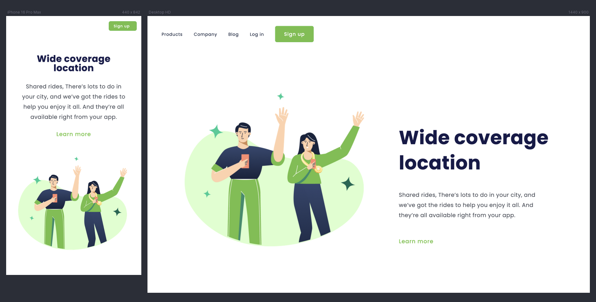

# Challenge 03: Positive Responsive

This project is a **responsive landing page** for a ride-sharing app, created as part of my learning journey in web
development. The objective was to adapt the **desktop-only layout** from a previous project
into a design that works on both **mobile** and **desktop** screens, while applying new concepts learned in
responsive web design.

## 📸 Screenshots

## 🔗 Links

&nbsp;&nbsp;

## 👷🏻‍♀️ Built with

- HTML
- CSS

### 🚀Features

- Semantic HTML
- Reset CSS
- Media Queries

## 👩🏻‍💻 Author

&nbsp;&nbsp;
&nbsp;&nbsp;

